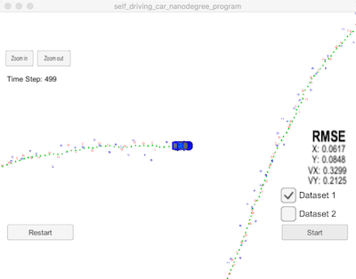

# Unscented Kalman Filter

#### Compiling
##### Code must compile without errors with cmake and make.

``` shell
Softwares-MacBook-Pro:tmp david$ git clone https://github.com/autohandle/CarNDUnscentedKalmanFilterProject.git
Cloning into 'CarNDUnscentedKalmanFilterProject'...
remote: Counting objects: 513, done.
remote: Compressing objects: 100% (375/375), done.
remote: Total 513 (delta 135), reused 513 (delta 135), pack-reused 0
Receiving objects: 100% (513/513), 876.45 KiB | 4.74 MiB/s, done.
Resolving deltas: 100% (135/135), done.
Softwares-MacBook-Pro:tmp david$ cd CarNDUnscentedKalmanFilterProject/
Softwares-MacBook-Pro:CarNDUnscentedKalmanFilterProject david$ ls
CMakeLists.txt		buildXcode		install-mac.sh		readme.txt
README.md		cmakepatch.txt		install-ubuntu.sh	src
Softwares-MacBook-Pro:CarNDUnscentedKalmanFilterProject david$ mkdir build
Softwares-MacBook-Pro:CarNDUnscentedKalmanFilterProject david$ cd build
Softwares-MacBook-Pro:build david$ cmake ..
-- The C compiler identification is AppleClang 9.0.0.9000037
-- The CXX compiler identification is AppleClang 9.0.0.9000037
-- Check for working C compiler: /Applications/Xcode.app/Contents/Developer/Toolchains/XcodeDefault.xctoolchain/usr/bin/cc
-- Check for working C compiler: /Applications/Xcode.app/Contents/Developer/Toolchains/XcodeDefault.xctoolchain/usr/bin/cc -- works
-- Detecting C compiler ABI info
-- Detecting C compiler ABI info - done
-- Detecting C compile features
-- Detecting C compile features - done
-- Check for working CXX compiler: /Applications/Xcode.app/Contents/Developer/Toolchains/XcodeDefault.xctoolchain/usr/bin/c++
-- Check for working CXX compiler: /Applications/Xcode.app/Contents/Developer/Toolchains/XcodeDefault.xctoolchain/usr/bin/c++ -- works
-- Detecting CXX compiler ABI info
-- Detecting CXX compiler ABI info - done
-- Detecting CXX compile features
-- Detecting CXX compile features - done
-- Configuring done
-- Generating done
-- Build files have been written to: /tmp/CarNDUnscentedKalmanFilterProject/build
Softwares-MacBook-Pro:build david$ make
Scanning dependencies of target UnscentedKF
[ 25%] Building CXX object CMakeFiles/UnscentedKF.dir/src/ukf.cpp.o
[ 50%] Building CXX object CMakeFiles/UnscentedKF.dir/src/main.cpp.o
[ 75%] Building CXX object CMakeFiles/UnscentedKF.dir/src/tools.cpp.o
[100%] Linking CXX executable UnscentedKF
ld: warning: directory not found for option '-L/usr/local/Cellar/libuv/1.11.0/lib'
[100%] Built target UnscentedKF
Softwares-MacBook-Pro:build david$ ./UnscentedKF
Listening to port 4567
Connected!!!
```



#### Accuracy
#####  run against "obj_pose-laser-radar-synthetic-input.txt" RMSE should be less than or equal to the values [.09, .10, .40, .30]

The Unscented Kalman Filter run on obj_pose-laser-radar-synthetic-input.txt had a final RSME of: \[0.0616555, 0.0847325, 0.32956, 0.212253\]. The initial covariance P value was the Identity matrix set in the constructor, the inital x state was set by the first measurement value, a Laser measurement. The initial values for both std_a_  and std_yawdd_ were 0.6.

#### Follows the Correct Algorithm
#### Sensor Fusion algorithm
The algorithm is implemented in
[UKF::ProcessMeasurement](https://github.com/autohandle/CarNDUnscentedKalmanFilterProject/blob/c9128edb6d9b0dbce3230a258c313610472cc8e8/src/ukf.cpp#L133-L144)

``` C++
double UKF::ProcessMeasurement(const MeasurementPackage& theMeasurementPackage, const double theDeltaT) {
  MatrixXd sigmaPointsPrediction = Prediction(theDeltaT);
  double nis = Update(theMeasurementPackage, sigmaPointsPrediction);// updates KalmanState
  return nis;
}
```
[UKF::Prediction](https://github.com/autohandle/CarNDUnscentedKalmanFilterProject/blob/c9128edb6d9b0dbce3230a258c313610472cc8e8/src/ukf.cpp#L151-L164)
takes `deltaT` and predicts the location of the augmented sigma points. It also updates the kalman state with the predicted values for: the state vector and the covariance matrix.
``` C++
MatrixXd UKF::Prediction(double deltaT) {// updates KalmanState, returns Xsig_pred
  const MatrixXd sigmaPoints = generateSigmaPoints();
  const MatrixXd augmentedSigmaPoints = augmentSigmaPoints();
  const MatrixXd sigmaPointsPrediction = sigmaPointPrediction(deltaT, augmentedSigmaPoints);
  KalmanState predictedKalmanState=predictMeanAndCovariance(sigmaPointsPrediction);
  updateKalmanState(predictedKalmanState);
  return sigmaPointsPrediction;
}
```
[UKF::Update](https://github.com/autohandle/CarNDUnscentedKalmanFilterProject/blob/c9128edb6d9b0dbce3230a258c313610472cc8e8/src/ukf.cpp#L166-L178)
takes the locations of the predicted sigma points and the new measurement and updates the kalman state: the state vector and the covariance matrix.
``` C++
double UKF::Update(const MeasurementPackage& theMeasurementPackage, const Eigen::MatrixXd& xSigPredicted) {
  return Update(extractZMeasurement(theMeasurementPackage),xSigPredicted);
}

double UKF::Update(const Eigen::VectorXd& z, const Eigen::MatrixXd& xSigPredicted) {
  MatrixXd zSigmaPoints = transformSigmaPointsToMeasurements(xSigPredicted);
  VectorXd zPredicted = predictZ(zSigmaPoints);
  MatrixXd S = measurementCovarianceMatrix(zSigmaPoints, zPredicted);
  double nis = updateState(zSigmaPoints, zPredicted, xSigPredicted, S, z);
  return nis;
}
```
#### Handles the first measurements appropriately

The first measurement is recognized in 
[UKFProcessor::processMeasurement](https://github.com/autohandle/CarNDUnscentedKalmanFilterProject/blob/c9128edb6d9b0dbce3230a258c313610472cc8e8/src/ukf.cpp#L792-L798)
because `is_initialized` is not set.
``` C++
double UKFProcessor::processMeasurement(const MeasurementPackage& theMeasurementPackage,
                                              UKF *theFilter) {
  
  if (!is_initialized()) {
    initialize(theMeasurementPackage, theFilter, kalmanState());
    return 0.;
  }

  double deltaT=(theMeasurementPackage.timestamp_-time_us_)/1000000.;//in seconds
  time_us_= theMeasurementPackage.timestamp_;
  return (*theFilter).ProcessMeasurement(theMeasurementPackage, deltaT);
}
```
`UKFProcessor::processMeasurement` is called by [UKFProcessor::ProcessMeasurement](https://github.com/autohandle/CarNDUnscentedKalmanFilterProject/blob/c9128edb6d9b0dbce3230a258c313610472cc8e8/src/ukf.cpp#L771-L790)
after the correct filter \(Radar or Lidar\) in the
[MeasurementPackage](./src/measurement_package.h)
is identified.
``` C++
double UKFProcessor::ProcessMeasurement(const MeasurementPackage& theMeasurementPackage) {
  
  switch(theMeasurementPackage.sensor_type_) {
    case MeasurementPackage::RADAR :
      if (Tools::TESTING) std::cout << "UKFProcessor::RADAR" << std::endl;
      if (useRadar()) {
        return processMeasurement(theMeasurementPackage, &radarFilter);
      }
      break;
    case MeasurementPackage::LASER :
      if (Tools::TESTING) std::cout << "UKFProcessor::LIDAR" << std::endl;
      if (useLidar()) {
        return processMeasurement(theMeasurementPackage, &lidarFilter);
      }
      break;
    default :
      throw std::invalid_argument("");
  }
  throw std::logic_error("Not Implemented");
}
```
`UKFProcessor::processMeasurement` can then call
[UKFProcessor::initialize](https://github.com/autohandle/CarNDUnscentedKalmanFilterProject/blob/c9128edb6d9b0dbce3230a258c313610472cc8e8/src/ukf.cpp#L805-L841)
to have the correct filter convert the measurement into a state to initialize the first kalman state.
``` C++
void UKFProcessor::initialize(const MeasurementPackage& theMeasurementPackage,
                              UKF *theFilter,
                              KalmanState& theKalmanState) {
  if (!is_initialized()) {
    initialize(theMeasurementPackage,
               (*theFilter).transformMeasurementToState(theMeasurementPackage.raw_measurements_),
               theKalmanState);
  }
}

void UKFProcessor::initialize(const MeasurementPackage& theMeasurementPackage,
                              const VectorXd theInitialState,
                              KalmanState& theKalmanState) {
  if (!is_initialized()) {
    time_us_= theMeasurementPackage.timestamp_;
        
    KalmanState newKalmanState=
    KalmanState::KalmanState(theInitialState, theKalmanState.P());
    theKalmanState.update(newKalmanState);

    is_initialized_ = true;
  }
}
```
To correct set the initial state, the
[RadarFilter::transformMeasurementToState](https://github.com/autohandle/CarNDUnscentedKalmanFilterProject/blob/c9128edb6d9b0dbce3230a258c313610472cc8e8/src/ukf.cpp#L659-L677)
``` C++
VectorXd RadarFilter::transformMeasurementToState(const VectorXd& theRawMeasurements) {
  assert(n_z()==3);
  assert(theRawMeasurements.size()==n_z());
  double rho = theRawMeasurements(0);
  double phi = theRawMeasurements(1);
  double rhodot = theRawMeasurements(2);
  
  double vx = rho * cos(phi);
  double vy = rho * sin(phi);
  
  assert(n_x()==5);
  VectorXd state = VectorXd(n_x());
  state(0) = rho*cos(phi);
  state(1) = rho*sin(phi);
  state(2) = sqrt(vx*vx+vy*vy);
  state(3) = 0.;
  state(4) = 0.;
  return state;
}
```
is different from the
[LidarFilter::transformMeasurementToState](https://github.com/autohandle/CarNDUnscentedKalmanFilterProject/blob/c9128edb6d9b0dbce3230a258c313610472cc8e8/src/ukf.cpp#L723-L736)
``` C++
VectorXd LidarFilter::transformMeasurementToState(const VectorXd& theRawMeasurements) {
  assert(n_z()==2);
  assert(theRawMeasurements.size()==n_z());
  double px = theRawMeasurements(0);
  double py = theRawMeasurements(1);
  assert(n_x()==5);
  VectorXd state = VectorXd(n_x());
  state(0) = px;
  state(1) = py;
  state(2) = 0.;
  state(3) = 0.;
  state(4) = 0.;
  return state;
}
```
#### Algorithm first predicts then updates
[UKF::ProcessMeasurement](https://github.com/autohandle/CarNDUnscentedKalmanFilterProject/blob/c9128edb6d9b0dbce3230a258c313610472cc8e8/src/ukf.cpp#L133-L144)
first calls Prediction and then calls Update
``` C++
double UKF::ProcessMeasurement(const MeasurementPackage& theMeasurementPackage, const double theDeltaT) {
  MatrixXd sigmaPointsPrediction = Prediction(theDeltaT);
  double nis = Update(theMeasurementPackage, sigmaPointsPrediction);// updates KalmanState
  return nis;
}
```
#### Can handle radar and lidar measurements.
[UKFProcessor::ProcessMeasurement](https://github.com/autohandle/CarNDUnscentedKalmanFilterProject/blob/c9128edb6d9b0dbce3230a258c313610472cc8e8/src/ukf.cpp#L771-L790)
selects the correct filter, either \(Radar or Lidar\) from the `sensor_type_` in the 
[MeasurementPackage](./src/measurement_package.h).
``` C++
double UKFProcessor::ProcessMeasurement(const MeasurementPackage& theMeasurementPackage) {
  
  switch(theMeasurementPackage.sensor_type_) {
    case MeasurementPackage::RADAR :
      if (Tools::TESTING) std::cout << "UKFProcessor::RADAR" << std::endl;
      if (useRadar()) {
        return processMeasurement(theMeasurementPackage, &radarFilter);
      }
      break;
    case MeasurementPackage::LASER :
      if (Tools::TESTING) std::cout << "UKFProcessor::LIDAR" << std::endl;
      if (useLidar()) {
        return processMeasurement(theMeasurementPackage, &lidarFilter);
      }
      break;
    default :
      throw std::invalid_argument("");
  }
  throw std::logic_error("Not Implemented");
}
```
#### Code Efficiency

##### Your algorithm should avoid unnecessary calculations.

The program was restructured to use object inheritance to improved comprehension and reduce the number of if-statement checks.


#### Setting sigma for `std_a_` and `std_yawdd_`

Although the nis was calculated, `std_a_` and `std_yawdd_` were set using RSME handheld gradient descent in
[main.cpp](https://github.com/autohandle/CarNDUnscentedKalmanFilterProject/blob/c9128edb6d9b0dbce3230a258c313610472cc8e8/src/main.cpp#L286-L301)

``` C++
if (Tools::SEARCHING && (argc>1)) {
cout<<"SEARCHING argc: "<< argc <<"\n";
for (int standardDeviation=1; standardDeviation<10; standardDeviation++) {
  estimations.clear();
  ground_truth.clear();
  MatrixXd processNoiseQ = UKF::newCovariance(2, standardDeviation*0.1, 0.6);
  KalmanState kalmanState = KalmanState(5);
  cout <<"SEARCHING-standardDeviation: "<< standardDeviation*0.1 << "\n";
  cout <<"SEARCHING-processNoiseQ: <"<< Tools::toString(processNoiseQ) << "\n";
  UKFProcessor ukfProcessor = UKFProcessor(kalmanState,7/*numberof augmented states*/,
                                           radarR, lidarR, processNoiseQ);
  VectorXd rsme = runAsFileProcessor(ukfProcessor, argv[1]);
  cout <<"SEARCHING-rsme: <"<< Tools::toString(rsme) << "\n";
}
```
First `std_yawdd_` was left at 30 and then `std_a_` was iterated from .1
```
SEARCHING-standardDeviation: 0.1
SEARCHING-processNoiseQ: <[2x2]=
[0.01    0],
[   0 0.64]
SEARCHING-rsme: <[4x_]:
[0.0825591,
0.126184,
0.350278,
0.247264]

...

SEARCHING-standardDeviation: 0.5
SEARCHING-processNoiseQ: <[2x2]=
[0.25    0],
[   0 0.64]
SEARCHING-rsme: <[4x_]:
[0.0597576,
0.0865825,
0.331234,
0.215768]
SEARCHING-standardDeviation: 0.6
SEARCHING-processNoiseQ: <[2x2]=
[0.36    0],
[   0 0.64]
SEARCHING-rsme: <[4x_]:
[0.0610295,
0.0852075,
0.331,
0.214751]
SEARCHING-standardDeviation: 0.7
SEARCHING-processNoiseQ: <[2x2]=
[0.49    0],
[   0 0.64]

...
...
```
then `std_a_` was set to .6 and `std_yawdd_` was iterated from .1
```
SEARCHING-standardDeviation: 0.1
SEARCHING-processNoiseQ: <[2x2]=
[0.36    0],
[   0 0.01]
SEARCHING-rsme: <[4x_]:
[0.112037,
0.112114,
0.420742,
0.327603]
SEARCHING-standardDeviation: 0.2
SEARCHING-processNoiseQ: <[2x2]=
[0.36    0],
[   0 0.04]
SEARCHING-rsme: <[4x_]:
[0.0745449,
0.0870828,
0.353645,
0.246509]

...

SEARCHING-rsme: <[4x_]:
[0.0636271,
0.0843614,
0.331769,
0.215775]
SEARCHING-standardDeviation: 0.5
SEARCHING-processNoiseQ: <[2x2]=
[0.36    0],
[   0 0.25]
SEARCHING-rsme: <[4x_]:
[0.062336,
0.0845163,
0.329871,
0.212797]
SEARCHING-standardDeviation: 0.6
SEARCHING-processNoiseQ: <[2x2]=
[0.36    0],
[   0 0.36]
SEARCHING-rsme: <[4x_]:
[0.0616555,
0.0847325,
0.32956,
0.212253]
SEARCHING-standardDeviation: 0.7
SEARCHING-processNoiseQ: <[2x2]=
[0.36    0],
[   0 0.49]
SEARCHING-rsme: <[4x_]:
[0.0612645,
0.0849679,
0.330054,
0.213075]
SEARCHING-standardDeviation: 0.8
SEARCHING-processNoiseQ: <[2x2]=
[0.36    0],
[   0 0.64]
SEARCHING-rsme: <[4x_]:
[0.0610295,
0.0852075,
0.331,
0.214751]

...
```

After iterating back and forth several times, 0.6 was selected for both.

#### Video Implementation

[Data Set 1 Video](https://s3.amazonaws.com/autohandle.com/video/UKF_DataSet_1.mp4)

[Data Set 2 Video](https://s3.amazonaws.com/autohandle.com/video/UKF_DataSet_2.mp4)

The video was created by using a [screen recording tool](http://www.idownloadblog.com/2016/02/26/how-to-record-part-of-mac-screen-quicktime/).