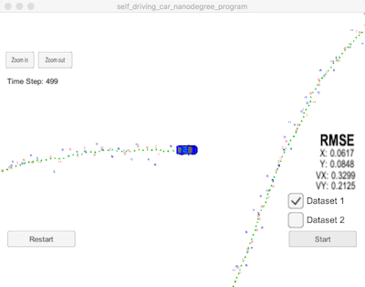

# Unscented Kalman Filter

#### Compiling
##### Code must compile without errors with cmake and make.

``` shell
	Softwares-MacBook-Pro:tmp david$ git clone https://github.com/autohandle/CarNDUnscentedKalmanFilterProject.git
	Cloning into 'CarNDUnscentedKalmanFilterProject'...
	remote: Counting objects: 513, done.
	remote: Compressing objects: 100% (375/375), done.
	remote: Total 513 (delta 135), reused 513 (delta 135), pack-reused 0
	Receiving objects: 100% (513/513), 876.45 KiB | 4.74 MiB/s, done.
	Resolving deltas: 100% (135/135), done.
	Softwares-MacBook-Pro:tmp david$ cd CarNDUnscentedKalmanFilterProject/
	Softwares-MacBook-Pro:CarNDUnscentedKalmanFilterProject david$ ls
	CMakeLists.txt		buildXcode		install-mac.sh		readme.txt
	README.md		cmakepatch.txt		install-ubuntu.sh	src
	Softwares-MacBook-Pro:CarNDUnscentedKalmanFilterProject david$ mkdir build
	Softwares-MacBook-Pro:CarNDUnscentedKalmanFilterProject david$ cd build
	Softwares-MacBook-Pro:build david$ cmake ..
	-- The C compiler identification is AppleClang 9.0.0.9000037
	-- The CXX compiler identification is AppleClang 9.0.0.9000037
	-- Check for working C compiler: /Applications/Xcode.app/Contents/Developer/Toolchains/XcodeDefault.xctoolchain/usr/bin/cc
	-- Check for working C compiler: /Applications/Xcode.app/Contents/Developer/Toolchains/XcodeDefault.xctoolchain/usr/bin/cc -- works
	-- Detecting C compiler ABI info
	-- Detecting C compiler ABI info - done
	-- Detecting C compile features
	-- Detecting C compile features - done
	-- Check for working CXX compiler: /Applications/Xcode.app/Contents/Developer/Toolchains/XcodeDefault.xctoolchain/usr/bin/c++
	-- Check for working CXX compiler: /Applications/Xcode.app/Contents/Developer/Toolchains/XcodeDefault.xctoolchain/usr/bin/c++ -- works
	-- Detecting CXX compiler ABI info
	-- Detecting CXX compiler ABI info - done
	-- Detecting CXX compile features
	-- Detecting CXX compile features - done
	-- Configuring done
	-- Generating done
	-- Build files have been written to: /tmp/CarNDUnscentedKalmanFilterProject/build
	Softwares-MacBook-Pro:build david$ make
	Scanning dependencies of target UnscentedKF
	[ 25%] Building CXX object CMakeFiles/UnscentedKF.dir/src/ukf.cpp.o
	[ 50%] Building CXX object CMakeFiles/UnscentedKF.dir/src/main.cpp.o
	[ 75%] Building CXX object CMakeFiles/UnscentedKF.dir/src/tools.cpp.o
	[100%] Linking CXX executable UnscentedKF
	ld: warning: directory not found for option '-L/usr/local/Cellar/libuv/1.11.0/lib'
	[100%] Built target UnscentedKF
	Softwares-MacBook-Pro:build david$ ./UnscentedKF
	Listening to port 4567
	Connected!!!
```



